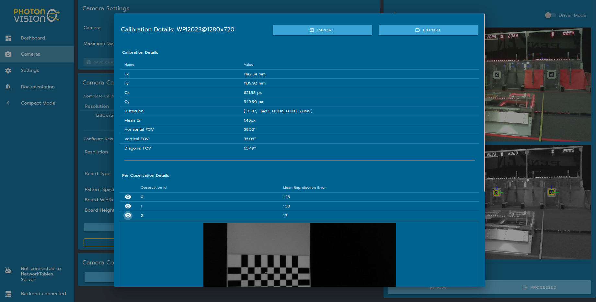
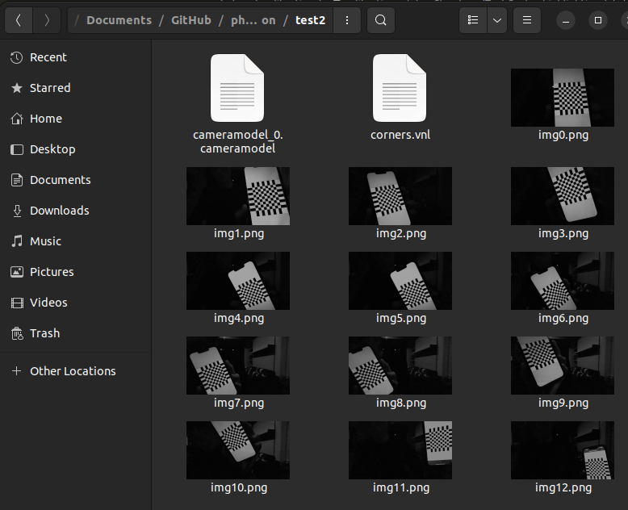
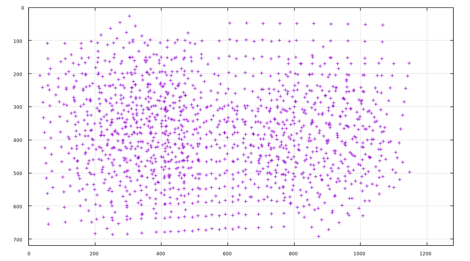
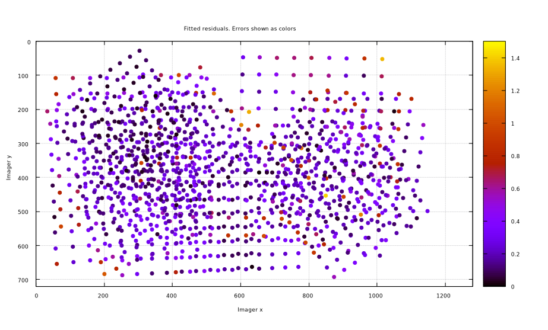
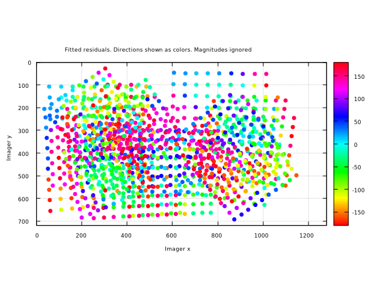
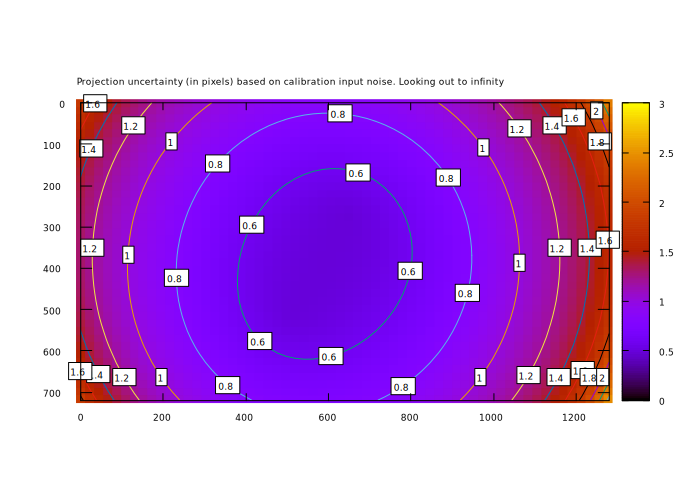

Calibrating Your Camera
=======================

.. important:: In order to detect AprilTags and use 3D mode, your camera must be calibrated at the desired resolution! Inaccurate calibration will lead to poor performance.

To calibrate a camera, images of a chessboard (or grid of dots, or other target) are taken. by comparing where the grid corners (or dots) should be in object space (for example, a dot once every inch in an 8x6 grid) with where they appear in the camera image, we can find a least-squares estimate for intrinsic camera properties like focal lengths, center point, and distortion coefficients. For more on camera calibration, please review the `OpenCV documentation <https://docs.opencv.org/4.x/dc/dbb/tutorial_py_calibration.html>`_.

.. warning:: While any resolution can be calibrated, resolutions lower than 960x720 are often too low to provide accurate results. Additionally, high resolutions may be too performance intensive for a coprocessor like a Raspberry Pi to handle (solutions to this are being looked into). Thus, we recommend 960x720 when using 3D mode.

.. note::The calibration data collected during calibration is specific to each physical camera, as well as each individual resolution.

Calibration Tips
----------------
Accurate camera calibration is required in order to get accurate pose measurements when using AprilTags and 3D mode. The tips below should help ensure success:

1. Practice calibration using your laptop webcam and https://www.calibdb.net/. The target can be found on the website and should be printed out if possible. Once you print it out, try to line up your target with the overlay on the screen as best as possible. The point of this practice is to notice how you are prompted to place targets in certain positions on the screen that make sure you account for all regions of the sensor. The chessboard should (in general) not be facing parallel to the camera (straight on), nor should it be aligned with any of the camera axes (ie, rotated only about an axis going left/right, up/down, or out-of-the-camera).

2. Ensure your the images you take have the target in different positions and angles, with as big of a difference between angles as possible. It is important to make sure the target overlay still lines up with the board while doing this. Tilt no more than 45 degrees.

3. Use as big of a calibration target as your printer can print.

4. Ensure that your printed pattern has enough white border around it.

5. Ensure your camera stays in one position during the duration of the calibration.

6. Make sure you get all 12 images from varying distances and angles.

7. Take at least one image that covers the total image area, and generally ensure that you get even coverage of the lens with your image set.

8. Have good lighting, having a diffusely lit target would be best (light specifically shining on the target without shadows).

9. Ensure the calibration target is completely flat and does not bend or fold in any way. It should be mounted/taped down to something flat and then used for calibration, do not just hold it up.

10. Avoid having targets that are parallel to the lens of the camera / straight on towards the camera as much as possible. You want angles and variations within your calibration images.

Following the ideas above should help in getting an accurate calibration.

Calibration Steps
-----------------

Your camera can be calibrated using either the utility built into PhotonVision, which performs all the calculations on your coprocessor, or using a website such as `calibdb <https://calibdb.net/>`_, which uses a USB webcam connected to your laptop. The integrated calibration utility is currently the only one that works with ribbon-cable CSI cameras or Limelights, but for USB webcams, calibdb is the preferred option.

Calibrating using calibdb
-------------------------

Calibdb uses a modified chessboard/aruco marker combination target called `ChArUco targets. <https://docs.opencv.org/4.8.0/df/d4a/tutorial_charuco_detection.html>`_ The website currently only supports Chrome browser.

Download and print out (or display on a monitor) the calibration by clicking Show Pattern. Click "Calibrate" and align your camera with the ghost overlay of the calibration board. The website automatically calculates the next position and displays it for you. When complete, download the calibration (do **not** use the OpenCV format). Reconnect your camera to your coprocessor and navigate to the PhotonVision web interface's camera tab. Ensure the correct camera is selected, and click the "Import from CalibDB" button. Your calibration data will be automatically saved and applied!

Calibrating using PhotonVision
------------------------------

1. Navigate to the calibration section in the UI.
^^^^^^^^^^^^^^^^^^^^^^^^^^^^^^^^^^^^^^^^^^^^^^^^^
The Cameras tab of the UI houses PhotonVision's camera calibration tooling. It assists users with calibrating their cameras, as well as allows them to view previously calibrated resolutions. We support both dot and chessboard calibrations.

2. Print out the calibration target.
^^^^^^^^^^^^^^^^^^^^^^^^^^^^^^^^^^^^

In the Camera Calibration tab, we'll print out the calibration target using the "Download" button. This should be printed on 8.5x11 printer paper. This page shows using an 8x8 chessboard.

.. warning:: Ensure that there is no scaling applied during printing (it should be at 100%) and that the PDF is printed as is on regular printer paper. Check the square size with calipers or an accurate measuring device after printing to ensure squares are sized properly, and enter the true size of the square in the UI text box. For optimal results, various resources are available online to calibrate your specific printer if needed.

3. Select calibration resolution and fill in appropriate target data.
^^^^^^^^^^^^^^^^^^^^^^^^^^^^^^^^^^^^^^^^^^^^^^^^^^^^^^^^^^^^^^^^^^^^^

We'll next select a resolution to calibrate and populate our pattern spacing and board size. The provided chessboard is 8 squares in width and height, and each square should be about 1in across. Mine measured with a caliper was 0.96in, but this will vary per printer. Finally, once our entered data is correct, we'll click "start calibration."

4. Take at calibration images from various angles.
^^^^^^^^^^^^^^^^^^^^^^^^^^^^^^^^^^^^^^^^^^^^^^^^^^

Now, we'll capture images of our chessboard from various angles. The most important part of this step is to make sure that the chessboard overlay matches the chessboard in your image. The further the overdrawn points are from the true position of the chessboard corners, the less accurate the final calibration will be. We'll want to capture at least 12 images, trying to take one in each region of the camera sensor. Once we've got our images, we'll click "Finish calibration" and wait for the calibration process to complete. If all goes well, the mean error and standard deviation will be shown in the table on the right.

.. raw:: html

        <video width="85%" controls>
            <source src="../../_static/assets/calibration_small.mp4" type="video/mp4">
            Your browser does not support the video tag.
        </video>

Accessing Calibration Images
----------------------------

Details about a particular calibration can be viewed by clicking on that resolution in the calibrations tab. This tab allows you to download raw calibration data, upload a previous calibration, and inspect details about calculated camera intrinsics.

.. note:: More info on what these parameters mean can be found in `OpenCV's docs <https://docs.opencv.org/4.8.0/d4/d94/tutorial_camera_calibration.html>`_

- Fx/Fy: Estimated camera focal length, in mm
- Fx/Cy: Estimated camera optical center, in pixels. This should be at about the center of the image
- Distortion: OpenCV camera model distortion coefficients
- FOV: calculated using estimated focal length and image size. Useful for gut-checking calibration results
- Mean Err: Mean reprojection error, or distance between expected and observed chessboard cameras for the full calibration dataset

Below these outputs are the snapshots collected for calibration, along with a per-snapshot mean reprojection error. A snapshot with a larger reprojection error might indicate a bad snapshot, due to effects such as motion blur or misidentified chessboard corners.

Calibration images can also be extracted from the downloaded JSON file using `this Python script <https://raw.githubusercontent.com/PhotonVision/photonvision/master/devTools/calibrationUtils.py>`_. This script will unpack calibration images, and also generate a VNL file for use `with mrcal <https://mrcal.secretsauce.net/>`_.

::

  python3 /path/to/calibrationUtils.py path/to/photon_calibration.json /path/to/output/folder

Investigating Calibration Data with mrcal
-----------------------------------------

`mrcal <https://mrcal.secretsauce.net/tour.html>`_ is a command-line tool for camera calibration and visualization. PhotonVision has the option to use the mrcal backend during camera calibration to estimate intrinsics. mrcal can also be used post-calibration to inspect snapshots and provide feedback. These steps will closely follow the `mrcal tour <https://mrcal.secretsauce.net/tour-initial-calibration.html>`_ -- I'm aggregating commands and notes here, but the mrcal documentation is much more thorough.

Start by `Installing mrcal <https://mrcal.secretsauce.net/install.html>`_. Note that while mrcal *calibration* using PhotonVision is supported on all platforms, but investigation right now only works on Linux. Some users have also reported luck using `WSL 2 on Windows <https://learn.microsoft.com/en-us/windows/wsl/tutorials/gui-apps>`ap_ as well. You may also need to install ``feedgnuplot``. On Ubuntu systems, these commands should be run from a standalone terminal and *not* the one `built into vscode <https://github.com/ros2/ros2/issues/1406>`_.

Let's run ``calibrationUtils.py`` as described above, and then cd into the output folder. From here, you can follow the mrcal tour, just replacing the VNL filename and camera imager size as necessary. My camera calibration was at 1280x720, so I've set the XY limits to that below.

::

   $ cd /path/to/output/folder
   $ ls
   matt@photonvision:~/Documents/Downloads/2024-01-02_lifecam_1280$ ls
     corners.vnl  img0.png  img10.png  img11.png  img12.png  img13.png  img1.png
     img2.png  img3.png  img4.png  img5.png  img6.png  img7.png  img8.png
     img9.png  cameramodel_0.cameramodel

   $ < corners.vnl       \
     vnl-filter -p x,y | \
     feedgnuplot --domain --square --set 'xrange [0:1280] noextend' --set 'yrange [720:0] noextend'

As you can see, we didn't do a fantastic job of covering our whole camera sensor -- there's a big gap across the whole right side, for example. We also only have 14 calibration images. We've also got our "cameramodel" file, which can be used by mrcal to display additional debug info.

Let's inspect our reprojection error residuals. We expect their magnitudes and directions to be random -- if there's patterns in the colors shown, then our calibration probably doesn't fully explain our physical camera sensor.

::

   $ mrcal-show-residuals --magnitudes --set 'cbrange [0:1.5]' ./camera-0.cameramodel
   $ mrcal-show-residuals --directions --unset key ./camera-0.cameramodel

Clearly we don't have anywhere near enough data to draw any meaningful conclusions (yet). But for fun, let's dig into `camera uncertainty estimation <https://mrcal.secretsauce.net/tour-uncertainty.html>`_. This diagram shows how expected projection error changes due to noise in calibration inputs. Lower projection error across a larger area of the sensor imply a better calibration that more fully covers the whole sensor. For my calibration data, you can tell the projection error isolines (lines of constant expected projection error) are skewed to the left, following my dataset (which was also skewed left).

::

   $ mrcal-show-projection-uncertainty --unset key ./cameramodel_0.cameramodel

