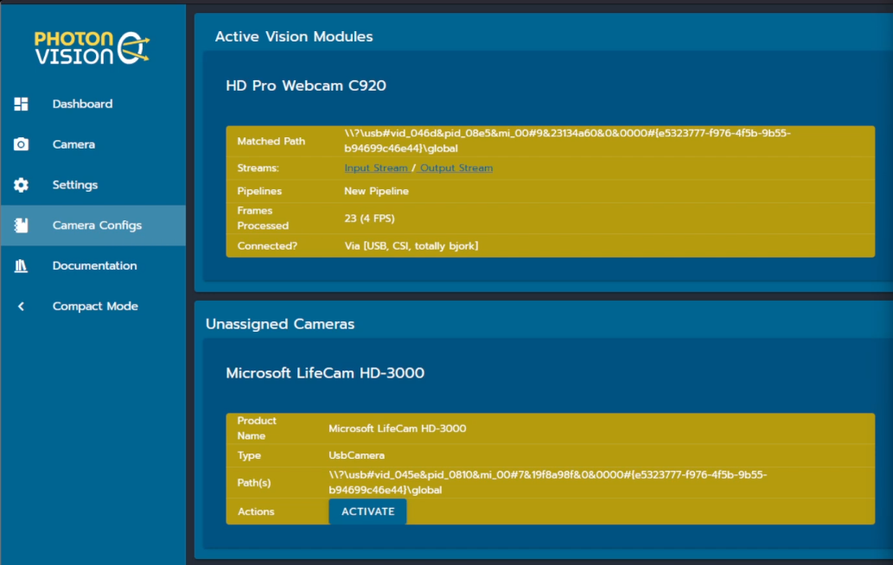

# Camera Matching

Diagrams generated by the [PlantUML UML editor](https://www.plantuml.com/plantuml/). Copy the image URLs below and decode in the editor to make changes.

## Initial Setup

When PhotonVision first starts, settings are loaded from disk and [VisionSources](https://javadocs.photonvision.org/org/photonvision/vision/processes/VisionSource.html) are created for every serialized & active [Camera Configuration](https://javadocs.photonvision.org/org/photonvision/common/configuration/CameraConfiguration.html)

## UI Workflow

A [background thread](https://javadocs.photonvision.org/org/photonvision/common/util/TimedTaskManager.html) will periodically query CSCore and Libcamera for what cameras we currently see connected. This list is provided to the web UI for display.

This UI allows users to "Activate" a camera that's never been seen before, or activate a CameraConfiguration we've seen before but was disabled. Allowing camera configurations to be saved but not loaded by default lets us support temporarily disabling/unplugging a camera without flooding log files.

Since our backend logic intentionally does not protect users from plugging camera B into the port that camera A was active on, the UI shall show a warning but vision processing will (attempt to) continue like normal.

### Activate New Camera

When a new camera (ie, one we can't match by-path to a deserialized CameraConfiguration) is activated, we'll create a spin up a new Vision Module for it

### Deactivate Camera

Deactivating a camera will release the native resources it owns, and return the CameraConfiguration to the pool of currently disabled cameras we can re-enable later.

### Reactivate a CameraConfig

When a new camera (ie, one we can't match by-path to a deserialized CameraConfiguration) is activated, we'll create and spin up a new Vision Module for it.

# Camera Matching Requirements

## Definitions
- VALID USB PATH: a path in the form `/dev/v4l/by-path/[UUID]`
- VIDEO DEVICE PATH: a CSCore-provided identifier derived from the V4L path `/dev/video[N]` on Linux, or an opaque string on Windows
- UNIQUE NAME: an identifier that is unique within the set of all deserialized CameraConfigurations and unmatched USB cameras
  - I don't love this, it means that a USB camera matched to a VisionModule will share a UNIQUE NAME, right?
- DESERIALIZED CAMERA CONFIGURATIONS: The set of camera configurations loaded from disk and provided to the VisionSourceManager. This configuration data structure includes the UNIQUE NAME
- CURRENTLY ACTIVE CAMERAS: The set of VisionModules currently active and processing vision data, and associated metadata

## Startup:

- GIVEN An empty set of deserialized Camera Configurations
 WHEN PhotonVision starts
 THEN no VisionModules will be started

- GIVEN A valid set of deserialized Camera Configurations
 WHEN PhotonVision starts
 THEN VisionModules will be started FOR EACH un-DISABLED config

- GIVEN A valid set of deserialized Camera Configurations
 WHEN PhotonVision starts
 THEN VisionModules will NOT be started FOR EACH DISABLED config

- GIVEN A CameraConfiguration with a VALID USB PATH
 WHEN a VisionModule is created
 THEN The VisionModule shall open the camera using the USB path

- GIVEN A CameraConfiguration without a valid USB path
 WHEN a VisionModule is created
 THEN The VisionModule shall open the camera using the VIDEO DEVICE PATH

## Camera (re)enumeration:

- GIVEN a NEW USB CAMERA is available for enumeration
 WHEN a USB camera is discovered by VisionSourceManager
 AND the USB camera's VIDEO DEVICE PATH is not in the set of DESERIALIZED CAMERA CONFIGURATIONS
 THEN a UNIQUE NAME will be assigned to the camera info

- GIVEN a NEW USB CAMERA is available for enumeration
 WHEN a USB camera is discovered by VisionSourceManager
 AND the USB camera's VIDEO DEVICE PATH is in the set of DESERIALIZED CAMERA CONFIGURATIONS
 THEN a UNIQUE NAME equal to the matching DESERIALIZED CAMERA CONFIGURATION will be assigned to the camera info
  - This is a weird case. How -should- we handle this? see above

## Creating from a new camera

- Given: A UNIQUE NAME from a NEW USB CAMERA
 WHEN I request a new VisionModule is created for this NEW USB CAMERA
 AND the camera has a VALID USB PATH
 AND the camera's VALID USB PATH is not in use by any CURRENTLY ACTIVE CAMERAS
 THEN a NEW VisionModule will be started for the NEW USB CAMERA using the VALID USB PATH

- Given: A UNIQUE NAME from a NEW USB CAMERA
 WHEN I request a new VisionModule is created for this NEW USB CAMERA
 AND the camera does not have a VALID USB PATH
 AND the camera's VIDEO DEVICE PATH is not in use by any CURRENTLY ACTIVE CAMERAS
 THEN a NEW VisionModule will be started for the NEW USB CAMERA using the VIDEO DEVICE PATH

## Deactivate

- Given: A UNIQUE NAME from a CURRENTLY ACTIVE CAMERA
 WHEN I request the VisionModule be DEACTIVATED
 THEN the VisionModule will be stopped for the given CURRENTLY ACTIVE CAMERA
 AND the CameraConfiguration DISABLED flag will be set to TRUE

## Reactivate

- Given: A UNIQUE NAME from a DESERIALIZED CAMERA CONFIGURATIONS
 WHEN I request the VisionModule be ACTIVATED
 AND the CameraConfiguration's DISABLED flag is TRUE
 THEN a VisionModule will be created and started for the camera
