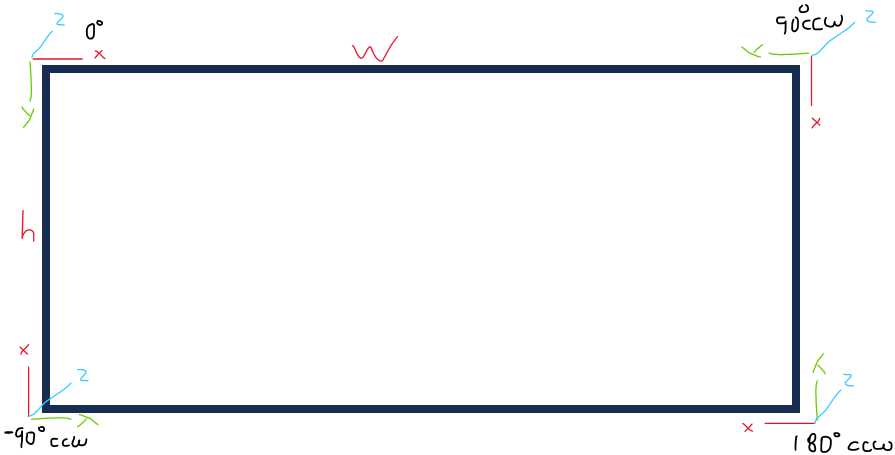

# Calibration and Image Rotation

## Rotating Points

To stay consistent with the OpenCV camera coordinate frame, we put the origin in the top left, with X right, Y down, and Z out (as required by the right-hand rule). Intuitively though, if I ask you to rotate an image 90 degrees clockwise though, you'd probably rotate it about -Z in this coordinate system. Just be aware of this inconsistency.



If we have any one point in any of those coordinate systems, we can transform it into any of the other ones using standard geometry libraries by performing relative transformations (like in this pseudocode):

```
Translation2d tag_corner1 = new Translation2d();
Translation2d rotated = tag_corner1.relativeTo(ORIGIN_ROTATED_90_CCW);
```

## Image Distortion

The distortion coefficients for OPENCV8 is given in order `[k1 k2 p1 p2 k3 k4 k5 k6]`. Mrcal names these coefficients `[k_0 k_1, k_2, k_3, k_4, k_5, k_6, k_7]`.

```{math}
    \begin{align*}
    \vec P &\equiv \frac{\vec p_{xy}}{p_z} \\
    r &\equiv \left|\vec P\right|            \\
    \vec P_\mathrm{radial} &\equiv \frac{ 1 + k_0 r^2 + k_1 r^4 + k_4 r^6}{ 1 + k_5 r^2 + k_6 r^4 + k_7 r^6} \vec P \\
    \vec P_\mathrm{tangential} &\equiv
    \left[ \begin{aligned}
        2 k_2 P_0 P_1 &+ k_3 \left(r^2 + 2 P_0^2 \right) \\
        2 k_3 P_0 P_1 &+ k_2 \left(r^2 + 2 P_1^2 \right)
    \end{aligned}\right] \\
    \vec q &= \vec f_{xy} \left( \vec P_\mathrm{radial} + \vec P_\mathrm{tangential} \right) + \vec c_{xy}
    \end{align*}
```

From this, we observe at `k_0, k_1, k_4, k_5, k_6, k_7` depend only on the norm of {math}`\vec P`, and will be constant given a rotated image. However, `k_2` and `k_3` go with {math}`P_0 \cdot P_1`, `k_3` with {math}`P_0^2`, and `k_2` with {math}`P_1^2`.

Let's try a concrete example. With a 90 degree CCW rotation, we have {math}`P0=-P_{1\mathrm{rotated}}` and {math}`P1=P_{0\mathrm{rotated}}`. Let's substitute in

```{math}
    \begin{align*}
    \left[ \begin{aligned}
        2 k_2 P_0 P_1 &+ k_3 \left(r^2 + 2 P_0^2 \right) \\
        2 k_3 P_0 P_1 &+ k_2 \left(r^2 + 2 P_1^2 \right)
    \end{aligned}\right] &=
    \left[ \begin{aligned}
        2 k_{2\mathrm{rotated}} (-P_{1\mathrm{rotated}}) P_{0\mathrm{rotated}} &+ k_{3\mathrm{rotated}} \left(r^2 + 2 (-P_{1\mathrm{rotated}})^2 \right) \\
        2 k_{3\mathrm{rotated}} (-P_{1\mathrm{rotated}}) P_{0\mathrm{rotated}} &+ k_{2\mathrm{rotated}} \left(r^2 + 2 P_{0\mathrm{rotated}}^2 \right)
    \end{aligned}\right] \\
     &=
    \left[ \begin{aligned}
        -2 k_{2\mathrm{rotated}} P_{1\mathrm{rotated}} P_{0\mathrm{rotated}} &+ k_{3\mathrm{rotated}} \left(r^2 + 2 P_{1\mathrm{rotated}}^2 \right) \\
        -2 k_{3\mathrm{rotated}} P_{1\mathrm{rotated}} P_{0\mathrm{rotated}} &+ k_{2\mathrm{rotated}} \left(r^2 + 2 P_{0\mathrm{rotated}}^2 \right)
    \end{aligned}\right]
    \end{align*}
```

By inspection, this results in just applying another 90 degree rotation to the k2/k3 parameters. Proof is left as an exercise for the reader. Note that we can repeat this rotation to yield equations for tangential distortion for 180 and 270 degrees.

```{math}
    k_2'=-k_3
    k_3'=k_2
```
