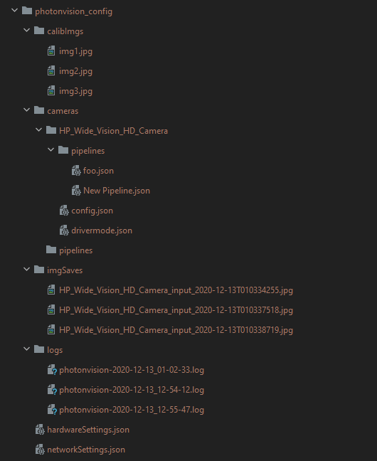

# PhotonVision Configuration System Design

Once upon a time, PhotonVision saved settings in a directory full of nested JSONs in `/opt/photonvision`. When the backend initiated a save, we would [delete the entire config directory](https://github.com/PhotonVision/photonvision/blob/f81304846251b82a128013ce0800a2cc1b71e744/photon-core/src/main/java/org/photonvision/common/configuration/ConfigManager.java#L194), then we'd [re-create each file one-by-one](https://github.com/PhotonVision/photonvision/blob/f81304846251b82a128013ce0800a2cc1b71e744/photon-core/src/main/java/org/photonvision/common/configuration/ConfigManager.java#L197C9-L247C40). This approach was easy, and human-readable, too!



This design was a carry-over from ChameleonVision, which had used a similar directory structure since config management was added in v2. These config files used to be stored on the FAT partition of your Raspberry Pi's SD card, but after reports of settings loss (the symptom usually just being a generic "my settings went poof" report), we moved the directory over to the root filesystem, which for our supported devices was NTFS.

"NTFS is a journalizing filesystem", we said. "It'll be so much more robust". 

In summer YEAR????, I found a [Pi forum post](a;sldfja;sdflj) that seemed to indicate there was perhaps some funny business happening with file caching. The Pi OS at the time tried its best to avoid writing updates to the physical SD card (SD cards are not designed to run an OS off of. Don't get me started.), which means that if you don't force flush/sync, changes can be lost on power cycle as they're never written to the SD card. In response we added flushes and [FileDescriptor::syncs](https://docs.oracle.com/javase/8/docs/api/java/io/FileDescriptor.html#sync--) to the code, and called it good.

And yet we kept getting reports of settings being lost. In particular, a Raspberry Pi base OS update that occurred during the summer of 2022 seemed to make this report more frequent. Reports tracked in GitHub included:
- 29 October, 2022: https://github.com/PhotonVision/photonvision/issues/552
- User reports from CD (todo link)
- User reports from Discord (todo link)

As of February 2023, we were making [every attempt available to us from Java](https://github.com/PhotonVision/photonvision/blob/f81304846251b82a128013ce0800a2cc1b71e744/photon-core/src/main/java/org/photonvision/common/util/file/JacksonUtils.java#L113C1-L118C34) to close, flush, and force a sync to the physical SD card for config files we serialized:

```java
    private static void saveJsonString(String json, Path path, boolean forceSync) throws IOException {
        var file = path.toFile();
        // snip for brevity
        FileOutputStream fileOutputStream = new FileOutputStream(file);
        fileOutputStream.write(json.getBytes());
        fileOutputStream.flush();
        if (forceSync) {
            FileDescriptor fileDescriptor = fileOutputStream.getFD();
            fileDescriptor.sync();
        }
        fileOutputStream.close();
    }
```

So in summary:
- Every time we saved to disk, we had to delete a directory recursively, then re-create its contents. We do this whenever settings are changed, as well as [immediately on startup](https://github.com/PhotonVision/photonvision/blob/f81304846251b82a128013ce0800a2cc1b71e744/photon-server/src/main/java/org/photonvision/Main.java#L348). Hopefully you don't turn off your robot at the wrong time.
- Even on the Pi's NTFS filesystem, even syncing the world on every write, we were still getting reports of settings being lost
    - In retrospect, some of these could be attributed to poor multi-camera matching code behavior (TODO link this GH issue), which was [updated in Summer 2024](camera-matching.md)

## What to do?

At the time we figured our options boiled down to "stop saving configs as multiple files". 

Databases like SQLite are also designed to be robust utilizing [atomic database commits](https://sqlite.org/atomiccommit.html). 
- We threw together a [SQLite proof-of-concept](https://github.com/PhotonVision/photonvision/pull/822/files)
- We also made an attempt at putting the same database into a ZIP file and [just atomically renaming it](https://github.com/PhotonVision/photonvision/pull/822/files) to replace the old config ZIP, using Java `File.move`'s [ATOMIC_MOVE](https://docs.oracle.com/javase/8/docs/api/java/nio/file/StandardCopyOption.html#ATOMIC_MOVE)

Both were tested, and we decided to go with SQLite. It was a rather spicy mid-season merge, but we felt that losing config data was already a game-over scenario, so anything was better than nothing.

The SQL config change landed [in !818 in March 2023](https://github.com/PhotonVision/photonvision/pull/818). With it, we just shove the exact same set of config files into a SQLite database instead of a 


