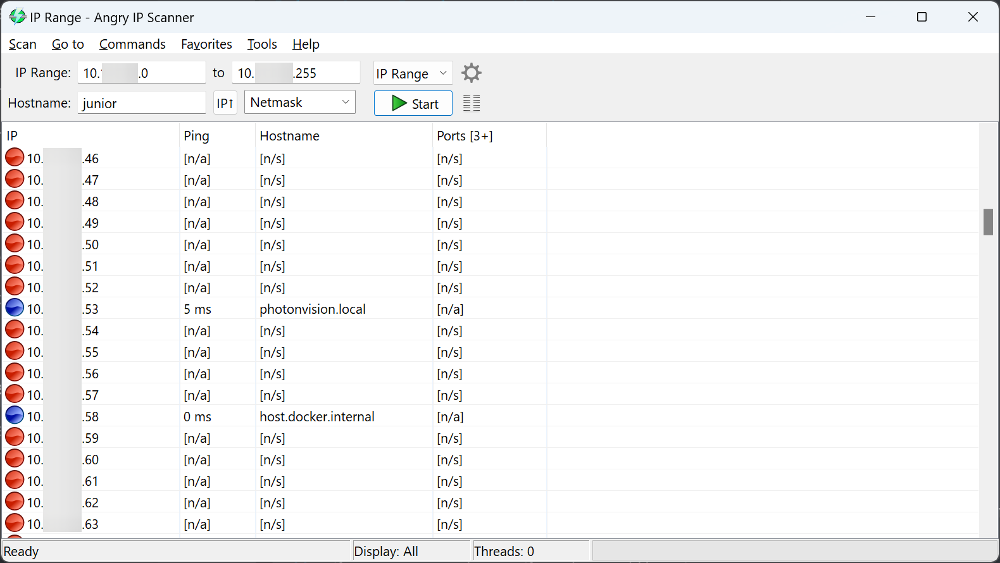

Gloworm Installation
====================
While not currently in production, PhotonVision still supports Gloworm vision processing cameras.

Downloading the Gloworm Image
-----------------------------
Download the latest `Gloworm/Limelight release of PhotonVision <https://github.com/photonvision/photonvision/releases>`_; the image will be suffixed with "image_limelight2.xz". You do not need to extract the downloaded archive.

Flashing the Gloworm Image
--------------------------
Plug a USB C cable from your computer into the USB C port on Gloworm labeled with a download icon.

Use the 1.18.11 version of `Balena Etcher <https://github.com/balena-io/etcher/releases/tag/v1.18.11>`_ to flash an image onto the coprocessor.

Run BalenaEtcher as an administrator. Select the downloaded ``.zip`` file.

Select the compute module. If it doesn't show up after 30s try using another USB port, initialization may take a while. If prompted, install the recommended missing drivers.

Hit flash. Wait for flashing to complete, then disconnect your USB C cable.

.. warning:: Using a version of Balena Etcher older than 1.18.11 may cause bootlooping (the system will repeatedly boot and restart) when imaging your Gloworm. Updating to 1.18.11 will fix this issue.

Final Steps
-----------
Power your device per its documentation and connect it to a robot network.

You should be able to locate the camera at ``http://photonvision.local:5800/`` in your browser on your computer when connected to the robot.

Troubleshooting/Setting a Static IP
-----------------------------------
A static IP address may be used as an alternative to the mDNS ``photonvision.local`` address.

Download and run `Angry IP Scanner <https://angryip.org/download/#windows>`_ to find PhotonVision/your coprocessor on your network.

Once you find it, set the IP to a desired :ref:`static IP in PhotonVision. <docs/settings:Networking>`

Updating PhotonVision
---------------------
Download the latest stable .jar from `the releases page <https://github.com/PhotonVision/photonvision/releases>`_, go to the settings tab, and upload the .jar using the Offline Update button.

.. note:: If you are updating PhotonVision on a Gloworm/Limelight, download the LinuxArm64 .jar file.

As an alternative option - Export your settings, reimage your coprocessor using the instructions above, and import your settings back in.

Hardware Troubleshooting
------------------------
To turn the LED lights off or on you need to modify the ``ledMode`` network tables entry or the ``camera.setLED`` of PhotonLib.

Support Links
-------------

* `Website/Documentation <https://photonvision.github.io/gloworm-docs/docs/quickstart/#finding-gloworm>`__ (Note: Gloworm is no longer in production)

* `Image <https://github.com/gloworm-vision/pi-img-updator/releases>`__

* `Discord <https://discord.com/invite/DncQRky>`__
