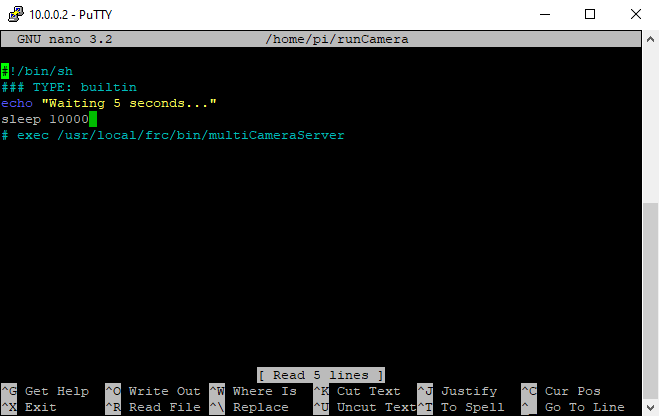

Romi Installation
=================

The `Romi <https://docs.wpilib.org/en/latest/docs/romi-robot/index.html>`_ is a small robot that can be controlled with the WPILib software.  The main controller is a Raspberry Pi that must be imaged with `WPILibPi <https://docs.wpilib.org/en/latest/docs/romi-robot/imaging-romi.html>`_ .

Installation
------------

The WPILibPi image includes FRCVision, which reserves USB cameras; to use PhotonVision, we need to edit the `/home/pi/runCamera` script to disable it.  First we will need to make the file system writeable; the easiest way to do this is to go to ``10.0.0.2`` and choose "Writable" at the top.

SSH into the Raspberry Pi (using Windows command line, or a tool like `Putty <https://www.chiark.greenend.org.uk/~sgtatham/putty/>`_ ) at the Romi's default address ``10.0.0.2``.  The default user is ``pi``, and the password is ``raspberry``.

Follow the process for installing PhotonVision on :ref:`"Other Debian-Based Co-Processor Installation" <docs/installation/sw_install/other-coprocessors:Other Debian-Based Co-Processor Installation>`.  As it mentions this will require an internet connection so plugging into the ethernet jack on the Raspberry Pi will be the easiest solution. The pi must remain writable!

Next, from the SSH terminal, run ``sudo nano /home/pi/runCamera`` then arrow down to the start of the exec line and press "Enter" to add a new line.  Then add ``#`` before the exec command to comment it out.  Then, arrow up to the new line and type ``sleep 10000``.  Hit "Ctrl + O" and then "Enter" to save the file.  Finally press "Ctrl + X" to exit nano.  Now, reboot the Romi by typing ``sudo reboot``.

After it reboots, you should be able to `locate the PhotonVision UI <https://photonvision.github.io/gloworm-docs/docs/quickstart/#finding-gloworm>`_ at: ``http://10.0.0.2:5800/``.

.. warning:: In order for settings, logs, etc. to be saved / take effect, ensure that PhotonVision is in writable mode.
