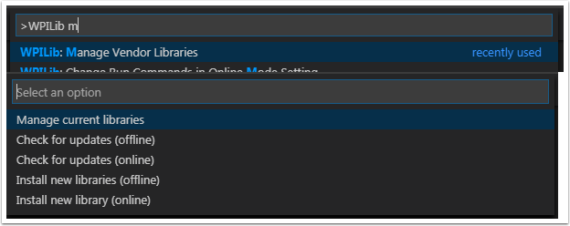

Installing PhotonLib
====================

What is PhotonLib?
------------------
PhotonLib is the C++ and Java vendor dependency that accompanies PhotonVision. We created this vendor dependency to make it easier for teams to retrieve vision data from their integrated vision system.

PhotonLibPy is a minimal, pure-python implementation of PhotonLib.

Online Install - Java/C++
-------------------------
Click on the WPI icon on the top right of your VS Code window or hit Ctrl+Shift+P (Cmd+Shift+P on macOS) to bring up the command palette. Type, "Manage Vendor Libraries" and select the "WPILib: Manage Vendor Libraries" option. Then, select the "Install new library (online)" option.

Paste the following URL into the box that pops up:

``https://maven.photonvision.org/repository/internal/org/photonvision/photonlib-json/1.0/photonlib-json-1.0.json``

.. note:: It is recommended to Build Robot Code at least once when connected to the Internet before heading to an area where Internet connectivity is limited (for example, a competition). This ensures that the relevant files are downloaded to your filesystem.

Offline Install - Java/C++
--------------------------
This installation option is currently a work-in-progress. For now, we recommend users use the online installation method.

Install - Python
----------------
Add photonlibpy to `pyproject.toml`.

.. code-block:: toml

    # Other pip packages to install
    requires = [
        "photonlibpy",
    ]

See `The WPILib/RobotPy docs <https://docs.wpilib.org/en/stable/docs/software/python/pyproject_toml.html>`_ for more information on using `pyproject.toml.`
