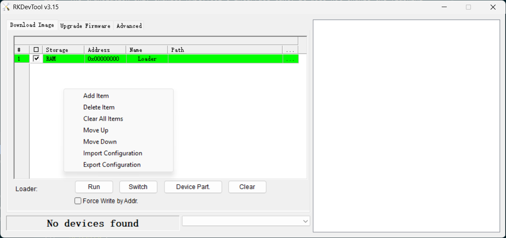
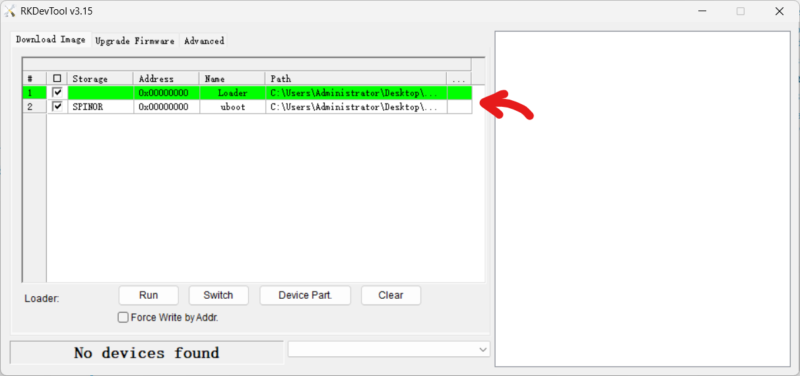
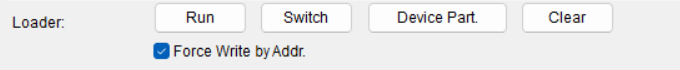

# Quick Installation Guide

- For the following supported coprocessors
  - {ref}`Raspberry Pi 3,4,5 <docs/quick-start/quick-install:Raspberry Pi and Orange Pi Installation>`
  - {ref}`Orange Pi 5, 5B, 5 Pro <docs/quick-start/quick-install:Raspberry Pi and Orange Pi Installation>`
  - {ref}`Limelight 2, 2+, 3, 3G, 4 <docs/quick-start/quick-install:LimeLight Installation>`
  - {ref}`Rubik Pi 3 <docs/quick-start/quick-install:Rubik Pi 3 Installation>`

For installing on non-supported devices {ref}`see here. <docs/advanced-installation/sw_install/index:Software Installation>`

[Download the latest preconfigured image of photonvision for your coprocessor](https://github.com/PhotonVision/photonvision/releases/latest)

| Coprocessor          | Image filename                                           | Jar                                   |
| -------------------- | -------------------------------------------------------- | ------------------------------------- |
| Raspberry Pi 3, 4, 5 | photonvision-{version}-linuxarm64_RaspberryPi.img.xz     | photonvision-{version}-linuxarm64.jar |
| OrangePi 5           | photonvision-{version}-linuxarm64_orangepi5.img.xz       | photonvision-{version}-linuxarm64.jar |
| OrangePi 5B          | photonvision-{version}-linuxarm64_orangepi5b.img.xz      | photonvision-{version}-linuxarm64.jar |
| OrangePi 5 Pro       | photonvision-{version}-linuxarm64_orangepi5pro.img.xz    | photonvision-{version}-linuxarm64.jar |
| Limelight 2          | photonvision-{version}-linuxarm64_limelight2.img.xz      | photonvision-{version}-linuxarm64.jar |
| Limelight 3          | photonvision-{version}-linuxarm64_limelight3.img.xz      | photonvision-{version}-linuxarm64.jar |
| Limelight 3G         | photonvision-{version}-linuxarm64_limelight3G.img.xz     | photonvision-{version}-linuxarm64.jar |
| Limelight 4          | photonvision-{version}-linuxarm64_limelight4.img.xz      | photonvision-{version}-linuxarm64.jar |
| Rubik Pi 3           | photonvision-{version}-linuxarm64_rubikpi3.tar.xz        | photonvision-{version}-linuxarm64.jar |

Unless otherwise noted in release notes or if updating from the prior years version, to update PhotonVision after the initial installation, use the offline update option in the settings page with the downloaded jar file from the latest release.

## Raspberry Pi and Orange Pi Installation

### microSD Installation

Use the [Raspberry Pi Imager](https://www.raspberrypi.com/software/) to flash the image onto the coprocessor's microSD card. Select the downloaded `.img.xz` file, select your microSD card, and flash.

:::{warning}
Avoid using Raspberry Pi Imager version 2.0.2 or later. Those versions fail to write the image to an SD card. Versions 2.0.0 and earlier write images successfully. [GitHub issue 1489](https://github.com/raspberrypi/rpi-imager/issues/1489) was created for this problem.
:::

:::{warning}
Balena Etcher has been recommended in the past, but should no longer be used due to instability and lack of ongoing support from developers.
:::

### USB Drive Installation

#### Bootloader Update/Configuration
::::{tab-set}
:::{tab-item} Raspberry Pi 3
```{note}
The Raspberry Pi 3B+ already has USB mass-storage boot enabled by default, so this procedure is not needed.

For Raspberry Pi 3B and other supported pre-3B+ models that do not already have USB host boot enabled, this procedure is required.

Programming the OTP is permanent, but it does not prevent the Pi from booting from microSD cards. On the Raspberry Pi 3A+, enabling USB host boot permanently disables USB device boot mode.
```

1. Download Raspberry Pi Imager

2. Select Raspberry Pi 3

3. Select Raspberry Pi OS (64-bit), then your storage device, and flash the image.

4. Insert the card into the Raspberry Pi 3, connect power and HDMI, boot it normally, and follow the onscreen instructions.

5. Open the terminal, and update the Raspberry Pi OS installation:

```shell
sudo apt update
sudo apt full-upgrade
```

6. Enable USB boot mode by programming the OTP:

```shell
echo program_usb_boot_mode=1 | sudo tee -a /boot/firmware/config.txt
sudo reboot
```

7. Verify that the OTP bit has been programmed:

```shell
vcgencmd otp_dump | grep 17:
```

The output should contain:

```text
17:3020000a
```

8. (optional) Remove the USB boot configuration from config.txt:

Once the OTP has been successfully programmed, you can remove the following line from /boot/firmware/config.txt if you want:

```text
program_usb_boot_mode=1
```
This setting is only required to program the OTP and does not need to remain enabled.

9. Shut down the Raspberry Pi 3 and remove the microSD card from the microSD slot.
:::

:::{tab-item} Raspberry Pi 4/5
1. Download Raspberry Pi Imager

2. Select your Raspberry Pi model

3. Scroll down to "Misc utility images" and select "Bootloader (Pi [model] Family)"

4. Select "USB boot" or "NVMe/USB boot" (depending on your model)

5. Select your microSD card and flash the bootloader image

6. Insert the microSD card into your Raspberry Pi and power it on. The bootloader will be updated and configured to boot from USB before microSD.

7. Wait for the green LED to blink rapidly, indicating that the update was successful. If an HDMI display is connected, the screen will also turn green. A red screen indicates that the update was unsuccessful.

8. Power off the Raspberry Pi and remove the microSD card.
:::

:::{tab-item} Rockchip-based boards (Orange Pi 5/5+, etc.)

Tested on the Orange Pi 5 and 5+. Other Rockchip boards may require different files, buttons, USB ports, or bootloaders; follow your board's official documentation.

Some Rockchip boards have an older SPI bootloader without USB boot support. Update it with the latest board-specific files before installing PhotonVision to USB.

The SPI bootloader update is separate from PhotonVision installation and normally only needs to be done once, unless a newer bootloader is released.

```{note}
This RKDevTool procedure requires Windows. For now, other operating systems are not supported.

This guide uses a corrected English translation for RKDevTool. Installing it is highly recommended because the button names and messages below match the corrected translation rather than the original, poorly translated English interface.

The translation only changes RKDevTool's interface text, and doesn't change the application itself or anything on your board.

Translation Download: [`English.ini`](additional-files/English.ini)

If the download is blocked, your web browser may need you to manually approve that file.
```

#### Links
RKDevTool: [Download](https://drive.google.com/file/d/1ypZnxyPEQE4TwLucElpccjmGMqwtoNB0/view?usp=drive_link)

Drivers: [Download](https://drive.google.com/file/d/1kTWzTh1TYBTVsv6mPDXKfLIqrImz-7gl/view?usp=drive_link)

#### Board-specific files
Click the file names to download the correct files for your board. If your board is not listed, consult your board's official documentation for the correct files.

| Board | SPI flash configuration | Temporary loader | SPI bootloader |
| ----- | ----------------------- | ---------------- | -------------- |
| Orange Pi 5 / 5+ | [`rk3588_linux_spiflash.cfg`](https://drive.google.com/file/d/1gLtVkRo21dOLxp-muqh01Him3ykWV_NV/view?usp=drive_link) | [`MiniLoaderAll.bin`](https://drive.google.com/file/d/1a79ElLfNc7RF1wS3U0pKCLfn-ygokZR9/view?usp=drive_link) | [`rkspi_loader.img`](https://drive.google.com/file/d/1XatmhEUU97JwSEq3F87SQq1iAaxTIK_V/view?usp=drive_link) |

1. Download RKDevTool, the Rockchip USB drivers, and the corrected `English.ini` (from above).

2. Extract RKDevTool and make backup copies of its original `config.ini` and `Language\English.ini`.

3. Edit `config.ini` so RKDevTool uses the English language file, then replace the original `English.ini` with the corrected version.

To edit `config.ini`, find the section below, and change the line `Selected=1` to `Selected=2` so it reads as follows:

```ini
[Language]
Kinds=2
Selected=2
LangPath=Language\
```

4. Install the Rockchip USB drivers, then open RKDevTool.

Double-click on `DriverInstall.exe`, allow it to run as administrator, and click on "Install Driver". Wait for the process to finish before proceeding. Once it finishes, you can close the application.

![RKDriverAssitant [sic] install](images/rkdevtool/driver_install.png)

5. Download the board-specific SPI flash configuration, temporary loader, and SPI bootloader image listed above.

6. Import the board-specific SPI flash configuration into RKDevTool by right-clicking anywhere in the table area and selecting "Import Configuration".

7. Select the board-specific temporary loader as the loader and SPI bootloader image as the U-Boot image. For each file, click the corresponding box under the "..." in the table and select the correct file.

8. Connect the board's programming USB port to the computer.

9. Enter MaskROM mode using the method specified for your board.

For the Orange Pi 5 and 5+, hold the MaskROM button while connecting the board's power USB-C port to the same computer.

Other boards may require you to connect a jumper, short specific pins, or hold a different button. Consult your board's official documentation for the correct procedure.

```{warning}
For boards that use two USB-C connections for power and data, connect both cables to the same computer. Do not connect the power cable to a separate power supply.

For boards with different power requirements, follow the manufacturer's documentation for the correct flashing procedure.
```

10. Confirm that RKDevTool detects the board in MaskROM mode. In the bottom-left corner of the window, it will say "Found One MaskROM Device".

```{note}
If it says "No devices found" or anything else:
- Check your USB connection and drivers
- Make sure only one device is connected to the computer
- Ensure the board is powered on and working

If the board is still not detected, try using a different USB port or cable. Some USB-C cables are power-only and do not support data transfer.
```

11. Tick the "Force Write by Addr." checkbox, then click "Run".

12. Wait for RKDevTool to report that the operation completed successfully in the log section on the right.

RKDevTool is only being used here to update the U-Boot-based bootloader stored in SPI flash. PhotonVision itself is stored on the separately prepared boot device.
:::

#### Flashing the USB drive
1. Download the PhotonVision image for your supported device and Raspberry Pi Imager.
2. Use Raspberry Pi Imager to write the image to a USB drive.
3. Connect the USB drive to a USB 3.0 port on the board.

## Limelight Installation

In order to flash your Limelight you should follow the instructions on the Limelight documentation for the relevant version. Make sure to replace the Limelight OS image with the relevant PhotonVision image.

| Limelight Version | Limelight Documentation                                                                                 | PhotonVision Image                                                                                                         |     |
| ----------------- | ------------------------------------------------------------------------------------------------------- | -------------------------------------------------------------------------------------------------------------------------- | --- |
| 2                 | [Updating Limelight 2 OS](https://docs.limelightvision.io/docs/docs-limelight/getting-started/limelight-2#4-updating-limelightos)  | photonvision-{version}-linuxarm64_limelight2.img.xz  |     |
| 3                 | [Updating Limelight 3 OS](https://docs.limelightvision.io/docs/docs-limelight/getting-started/limelight-3#4-updating-limelightos)  | photonvision-{version}-linuxarm64_limelight3.img.xz  |     |
| 3G                | [Updating Limelight 3G OS](https://docs.limelightvision.io/docs/docs-limelight/getting-started/limelight-3g#4-updating-limelightos) | photonvision-{version}-linuxarm64_limelight3g.img.xz |     |
| 4                 | [Updating Limelight 4 OS](https://docs.limelightvision.io/docs/docs-limelight/getting-started/limelight-4#4-updating-limelightos)  | photonvision-{version}-linuxarm64_limelight4.img.xz  |     |

:::{note}
Limelight models will need a [custom hardware config file](https://github.com/PhotonVision/photonvision/tree/main/docs/source/docs/advanced-installation/sw_install/files) for LEDs or other hardware features to work.
:::

## Rubik Pi 3 Installation

:::{warning}
The Qualcomm Launcher caches files. If you flash multiple times, you may need to clear the cache by navigating to your temp directory, and deleting the `qualcomm-launcher` folder.
:::

To flash the Rubik Pi 3 coprocessor, it's necessary to use the [Qualcomm Launcher](https://softwarecenter.qualcomm.com/catalog/item/Qualcomm_Launcher). Upload a custom image by selecting the *Custom* option in the launcher. If this is your first time flashing this board, ensure you check the USB firmware option. Choose the downloaded PhotonVision `.tar.xz` file and follow the prompts to complete the installation. It is recommended to skip the *Configure Login* process, as PhotonVision will handle the necessary settings.

### Alternative Flashing Method (advanced users only)

Follow the specific steps listed below from the [Rubik Pi 3 Docs](https://www.thundercomm.com/rubik-pi-3/en/docs/rubik-pi-3-user-manual/1.0.0-u/Troubleshooting/11.1.flash-over-android/).

[Step 1](https://www.thundercomm.com/rubik-pi-3/en/docs/rubik-pi-3-user-manual/1.0.0-u/Troubleshooting/11.1.flash-over-android/#1%EF%B8%8F%E2%83%A3-setup-qdl-tool) should be completed once per computer. [Step 2](https://www.thundercomm.com/rubik-pi-3/en/docs/rubik-pi-3-user-manual/1.0.0-u/Troubleshooting/11.1.flash-over-android/#2%EF%B8%8F%E2%83%A3-ufs-provisioning) and [Step 3](https://www.thundercomm.com/rubik-pi-3/en/docs/rubik-pi-3-user-manual/1.0.0-u/Troubleshooting/11.1.flash-over-android/#3%EF%B8%8F%E2%83%A3-flash-renesas-firmware) should be completed once per Rubik Pi 3.

After completing these steps, unzip your downloaded PhotonVision image to a folder. Navigate to that folder in your terminal or command prompt. After putting your Rubik Pi 3 into EDL mode, run the command below to flash PhotonVision. There is no need to complete any further steps from the Rubik Pi 3 documentation after running this command.


::::{tab-set}
:::{tab-item} Ubuntu host
```shell
qdl --storage ufs prog_firehose_ddr.elf rawprogram*.xml patch*.xml
```
:::

:::{tab-item} Windows host
```shell
QDL.exe prog_firehose_ddr.elf rawprogram0.xml rawprogram1.xml rawprogram2.xml rawprogram3.xml rawprogram4.xml rawprogram5.xml rawprogram6.xml patch1.xml patch2.xml patch3.xml patch4.xml patch5.xml patch6.xml
```
:::

:::{tab-item} macOS host
```shell
qdl prog_firehose_ddr.elf rawprogram*.xml patch*.xml
```
:::
::::
