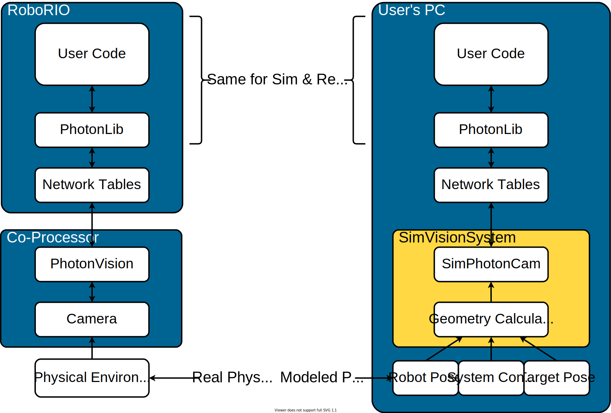

Simulation Support in PhotonLib (Deprecated)
============================================

.. attention:: This page details the pre-2024 simulation support. For current Java simulation support, see :doc:`/docs/simulation/simulation`.

What Is Supported?
------------------

PhotonLib supports simulation of a camera and coprocessor running PhotonVision moving about a field on a robot.

You can use this to help validate your robot code's behavior in simulation without needing a physical robot.

Simulation Vision World Model
-----------------------------

Sim-specific classes are provided to model sending one frame of a camera image through PhotonVision. Based on what targets are visible, results are published to NetworkTables.

While processing, the given robot ``Pose2d`` is used to analyze which targets should be in view, and determine where they would have shown up in the camera image.

Targets are considered in view if:

1) Their centroid is within the field of view of the camera.
2) The camera is not in driver mode.
3) The target's in-image pixel size is greater than ``minTargetArea``
4) The distance from the camera to the target is less than ``maxLEDRange``

.. warning:: Not all network tables objects are updated in simulation. The interaction through PhotonLib remains the same. Actual camera images are also not simulated.

Latency of processing is not yet modeled.

Simulated Vision System
-----------------------

A ``SimVisionSystem`` represents the camera and coprocessor running PhotonVision moving around on the field.

It requires a number of pieces of configuration to accurately simulate your physical setup. Match them to your configuration in PhotonVision, and to your robot's physical dimensions.

.. tab-set-code::

   .. rli:: https://raw.githubusercontent.com/PhotonVision/photonvision/80e16ece87c735e30755dea271a56a2ce217b588/photonlib-java-examples/simaimandrange/src/main/java/frc/robot/sim/DrivetrainSim.java
      :language: java
      :lines: 73-93

After declaring the system, you should create and add one ``SimVisionTarget`` per target you are attempting to detect.

.. tab-set-code::

   .. rli:: https://raw.githubusercontent.com/PhotonVision/photonvision/80e16ece87c735e30755dea271a56a2ce217b588/photonlib-java-examples/simaimandrange/src/main/java/frc/robot/sim/DrivetrainSim.java
      :language: java
      :lines: 95-111

Finally, while running the simulation, process simulated camera frames by providing the robot's pose to the system.

.. tab-set-code::

   .. rli:: https://raw.githubusercontent.com/PhotonVision/photonvision/80e16ece87c735e30755dea271a56a2ce217b588/photonlib-java-examples/simaimandrange/src/main/java/frc/robot/sim/DrivetrainSim.java
      :language: java
      :lines: 138-139

This will cause most NetworkTables fields to update properly, representing any targets that are in view of the robot.

Robot software which uses PhotonLib to interact with a camera running PhotonVision should work the same as though a real camera was hooked up and active.

Raw-Data Approach
-----------------

Users may wish to directly provide target information based on an existing detailed simulation.

A ``SimPhotonCamera`` can be created for this purpose. It provides an interface where the user can supply target data via a list of ``PhotonTrackedTarget`` objects.

.. tab-set-code::

   .. code-block:: java

      @Override
      public void simulationInit() {
          //  ...
          cam = new SimPhotonCamera("MyCamera");
          //  ...
      }

      @Override
      public void simulationPeriodic() {
          //  ...
          ArrayList<PhotonTrackedTarget> visibleTgtList = new ArrayList<PhotonTrackedTarget>();
          visibleTgtList.add(new PhotonTrackedTarget(yawDegrees, pitchDegrees, area, skew, camToTargetTrans)); // Repeat for each target that you see
          cam.submitProcessedFrame(0.0, visibleTgtList);
          //  ...
      }

Note that while there is less code and configuration required to get basic data into the simulation, this approach will cause the user to need to implement much more code on their end to calculate the relative positions of the robot and target. If you already have this, the raw interface may be helpful. However, if you don't, you'll likely want to be looking at the Simulated Vision System first.
