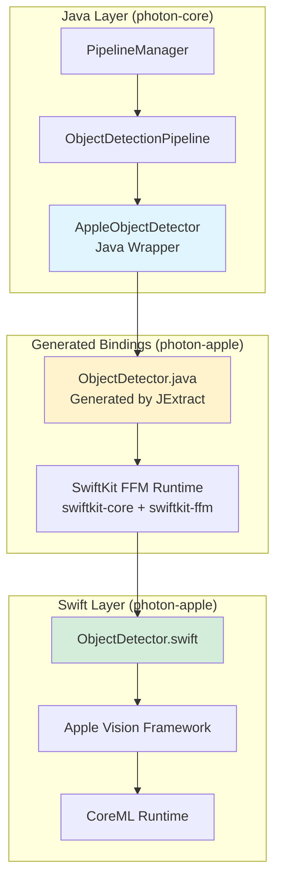
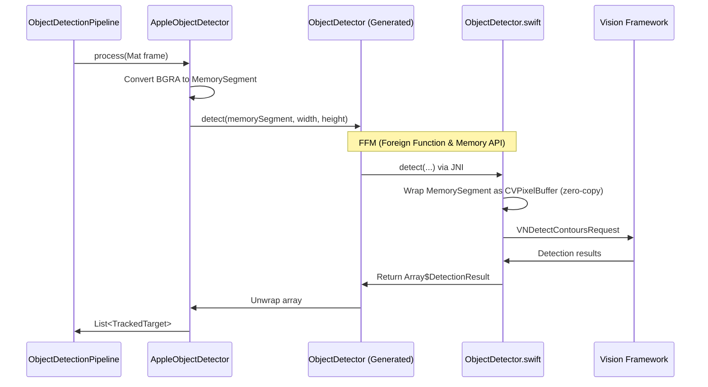
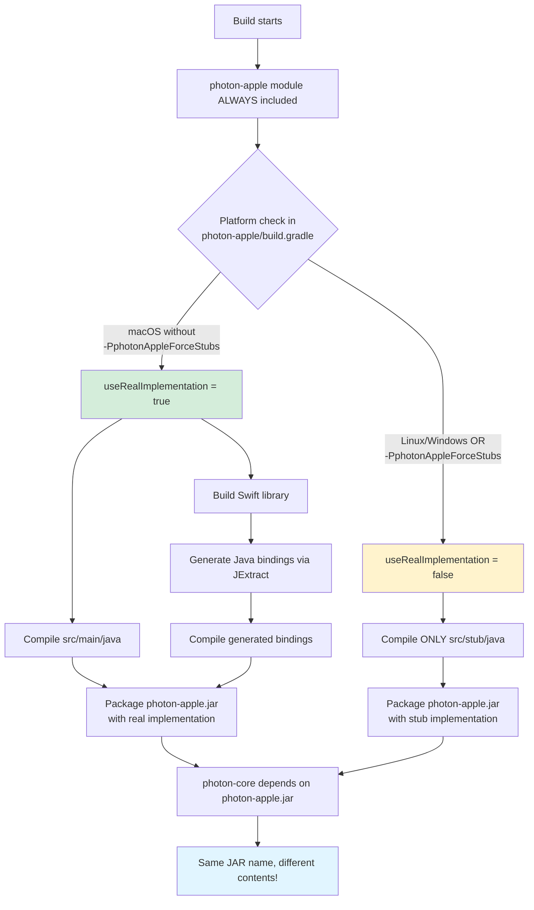
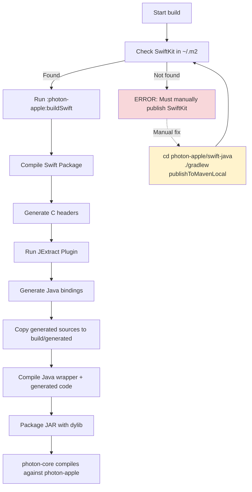
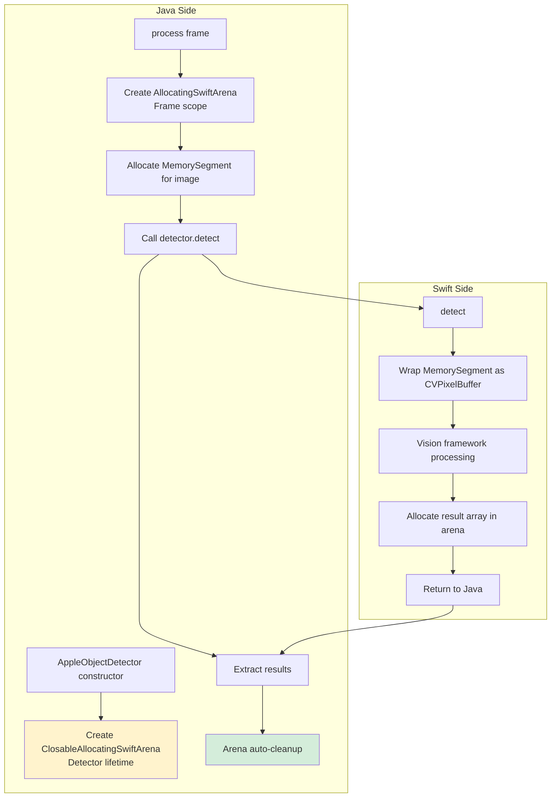
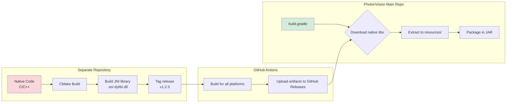
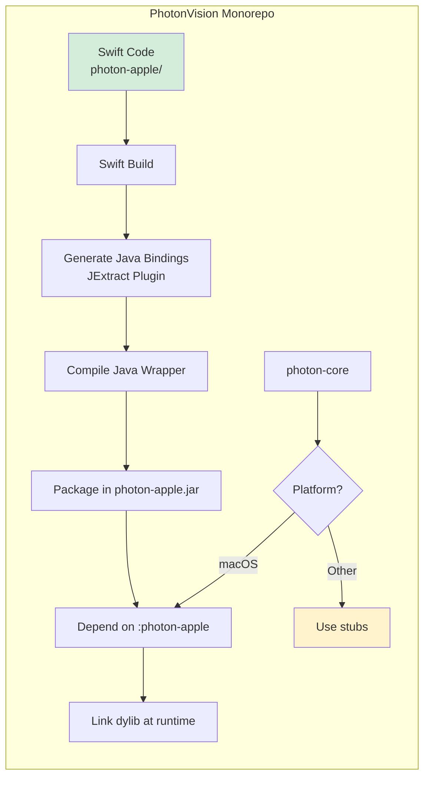

# Platform-Specific Native Wrappers in PhotonVision

## Table of Contents
- [Overview](#overview)
- [Architecture](#architecture)
- [Build System Integration](#build-system-integration)
- [Swift-Java Bridge](#swift-java-bridge)
- [Traditional vs Monorepo Approach](#traditional-vs-monorepo-approach)
- [CI/CD Considerations](#cicd-considerations)
- [Developer Workflow](#developer-workflow)
- [Technical Deep Dive](#technical-deep-dive)

## Overview

PhotonVision's `photon-apple` module represents a novel approach to integrating platform-specific native code into a cross-platform Java application. This module provides Apple Vision framework integration for CoreML-based object detection on macOS and iOS, leveraging Swift's native interoperability with Apple frameworks.

**Key Innovation**: This is the first PhotonVision module to use an in-monorepo native wrapper instead of the traditional separate-repository JNI approach. It demonstrates a path forward for monorepo-based native dependencies while maintaining cross-platform build compatibility.

### Why photon-apple?

Unlike other object detection backends (RKNN for Rockchip NPUs, Rubik for Google Coral), Apple's Vision framework is:
- **Swift-first**: No official C/C++ API exists
- **High-level**: Provides automatic image preprocessing, resizing, and NMS
- **Zero-copy capable**: Can wrap external memory buffers without copying
- **Tightly integrated**: Best performance on Apple Silicon through CoreML

## Architecture

### High-Level Component Diagram



### Module Structure

```
photon-apple/
├── Package.swift                          # Swift package definition
├── Sources/AppleVisionLibrary/
│   ├── ObjectDetector.swift              # Main detector implementation
│   ├── DetectionResult.swift             # Detection data structures
│   └── swift-java.config                 # JExtract configuration
├── src/main/java/
│   └── com/photonvision/apple/
│       └── ImageUtils.java               # Image format conversion
├── .build/plugins/outputs/               # Generated during build
│   └── .../src/generated/java/
│       └── com/photonvision/apple/
│           └── ObjectDetector.java       # Auto-generated Java bindings
└── swift-java/                           # Git submodule (vendored)
    └── SwiftKit/                         # Java-Swift interop library
```

### Data Flow



## Build System Integration

### Unconditional Module Inclusion

**Key Innovation**: The photon-apple module is **ALWAYS included on all platforms**. The module itself decides internally whether to compile real implementation or stubs.

**settings.gradle:**
```groovy
// photon-apple is always included, regardless of platform
include 'photon-apple'
```

**photon-core/build.gradle:**
```groovy
dependencies {
    // Always depend on photon-apple - no conditionals needed!
    implementation project(':photon-apple')
}
```

This is different from traditional platform-specific modules that are conditionally included. Instead, photon-apple compiles different source sets based on the platform.

### Stub Generation for Cross-Platform Builds

The innovation is that **stubs live inside the photon-apple module itself**, not in photon-core. The module's build.gradle decides which source directory to compile:

**photon-apple/build.gradle:**
```groovy
def isMacOS = System.getProperty("os.name").toLowerCase().contains("mac")
def forceStubs = project.hasProperty('photonAppleForceStubs')
def useRealImplementation = isMacOS && !forceStubs

if (useRealImplementation) {
    // macOS: Compile real implementation
    sourceSets {
        main {
            java {
                srcDirs = [
                    'src/main/java',  // Java wrapper code
                    '.build/plugins/outputs/.../src/generated/java'  // Generated Swift bindings
                ]
            }
        }
    }
    dependencies {
        api 'org.swift.swiftkit:swiftkit-core:1.0-SNAPSHOT'
        api 'org.swift.swiftkit:swiftkit-ffm:1.0-SNAPSHOT'
    }
} else {
    // Linux/Windows: Compile ONLY stubs
    sourceSets {
        main {
            java {
                srcDirs = ['src/stub/java']  // Stub implementations only!
            }
        }
    }
    // No SwiftKit dependencies
}
```

#### Build System Flow



#### Stub Implementation

**Stubs location**: `photon-apple/src/stub/java/com/photonvision/apple/`

The stub classes have **exactly the same package and class names** as the generated Swift bindings:

```java
// photon-apple/src/stub/java/com/photonvision/apple/ObjectDetector.java
// This mirrors the generated class from Swift
package com.photonvision.apple;

public final class ObjectDetector {
    private ObjectDetector() {}

    public static ObjectDetector init(String modelPath, Object swiftArena) {
        throw new UnsupportedOperationException("Apple object detection is only supported on macOS");
    }

    public DetectionResultArray detect(
            Object imageData, long width, long height, double boxThreshold, Object swiftArena) {
        throw new UnsupportedOperationException("Apple object detection is only supported on macOS");
    }
}
```

```java
// photon-apple/src/stub/java/com/photonvision/apple/SwiftArena.java
package com.photonvision.apple;

public class SwiftArena implements AutoCloseable {
    public static SwiftArena ofAuto() {
        throw new UnsupportedOperationException("SwiftArena is only supported on macOS");
    }

    public Object unwrap() {
        throw new UnsupportedOperationException("SwiftArena is only supported on macOS");
    }

    public void close() {
        // No-op stub
    }
}
```

The wrapper in photon-core uses these classes without knowing if they're real or stubs:

```java
// photon-core/src/main/java/org/photonvision/vision/objects/AppleObjectDetector.java
package org.photonvision.vision.objects;

import com.photonvision.apple.SwiftArena;  // Could be real or stub!
import com.photonvision.apple.ObjectDetector;  // Could be real or stub!

public class AppleObjectDetector implements ObjectDetector {
    private final SwiftArena detectorArena;
    private final com.photonvision.apple.ObjectDetector swiftDetector;

    public AppleObjectDetector(AppleModel model, Size inputSize) {
        // This will throw UnsupportedOperationException on non-macOS
        this.detectorArena = SwiftArena.ofAuto();
        this.swiftDetector = ObjectDetector.init(modelPath, detectorArena.unwrap());
    }
}
```

#### Why This Design is Brilliant

1. **photon-core has no platform-specific code** - it always imports `com.photonvision.apple.*` classes
2. **Same JAR name on all platforms** - `photon-apple.jar` exists everywhere, just with different contents
3. **No conditional compilation in consuming modules** - photon-core doesn't need `if (hasPhotonApple)` checks
4. **Dependency graph stays simple** - photon-core → photon-apple on all platforms
5. **Stubs match generated API exactly** - same package, same class names, same method signatures
6. **Linux/Windows developers can build the entire codebase** - they get a working build with stubs, without needing macOS
7. **Single source of truth for API** - if the generated Swift API changes, the stubs must be manually updated to match

#### Developer Experience Benefits

**Without stubs (naive approach):**
```groovy
// settings.gradle
if (isMacOS) {
    include ':photon-apple'
}

// photon-core/build.gradle
dependencies {
    if (isMacOS) {
        implementation project(':photon-apple')
    }
}
```

Problems:
- Linux/Windows developers can't compile photon-core (missing dependency)
- IDE shows compile errors for `import com.photonvision.apple.*`
- Can't run tests that reference Apple detector
- Gradle configuration becomes complex

**With stubs (current approach):**
```groovy
// settings.gradle
include ':photon-apple'  // Always!

// photon-core/build.gradle
dependencies {
    implementation project(':photon-apple')  // Always!
}
```

Benefits:
- Linux/Windows developers get a full working build
- IDE autocomplete works for Apple classes
- Tests compile (runtime throws UnsupportedOperationException if Apple detector is used)
- Gradle configuration stays simple
- New platform-specific modules can follow the same pattern

### Build Process on macOS



### Gradle Task Configuration

**photon-apple/build.gradle:**

```groovy
// CRITICAL: SwiftKit must be manually published
// publishSwiftKitLocal task is disabled (broken with parent gradle flags)
// Developer must run: cd photon-apple/swift-java && ./gradlew publishToMavenLocal

dependencies {
    implementation "org.swift.swiftkit:swiftkit-core:1.0-SNAPSHOT"
    implementation "org.swift.swiftkit:swiftkit-ffm:1.0-SNAPSHOT"
}

task buildSwift(type: Exec) {
    workingDir file('.')
    commandLine 'swift', 'build', '-c', 'release'

    doLast {
        // JExtract plugin runs here, generates Java bindings
    }
}

// Generated sources are added to sourceSets
sourceSets {
    main {
        java {
            srcDirs += [
                file('.build/plugins/outputs/.../src/generated/java')
            ]
        }
    }
}

// Ensure Swift builds before Java compilation
compileJava.dependsOn buildSwift
```

### Force Stubs for photon-lib Builds

PhotonLib (the vendordep for FRC robots) requires Java 17 compatibility, but the real photon-apple implementation requires Java 25 for FFM APIs. Therefore, **photon-lib builds always use stubs, even on macOS**:

```bash
# photon-lib builds (even on macOS)
./gradlew photon-lib:build -PphotonAppleForceStubs
```

When `-PphotonAppleForceStubs` is set:
- photon-apple compiles with Java 17 instead of Java 25
- photon-apple only compiles `src/stub/java` (skips Swift build and generated bindings)
- The resulting photon-lib.jar can run on FRC robots (Java 17)

This is used extensively in CI:

```yaml
# .github/workflows/build.yml
- name: Build photon-lib
  run: ./gradlew photon-lib:build -PphotonAppleForceStubs
```

For testing non-macOS behavior on macOS (e.g., simulating Linux builds on macOS runners), the same flag works for photon-server builds too.

## Swift-Java Bridge

### FFM vs JNI: The Choice

Swift-Java provides two interop modes:

| Mode | Memory Passing | Return Types | Status | Used in PhotonVision |
|------|---------------|--------------|---------|---------------------|
| **JNI** | Pointer as `long`, manual cast in Swift | Native arrays (`int[]`, `double[]`) | Stable, traditional | ❌ No |
| **FFM** | Direct `MemorySegment` as unsafe pointer | Wrapper objects (`Array$DetectionResult`) | Future-facing (Java 22+) | ✅ Yes |

**Why FFM?**

1. **Zero-copy image passing**: `MemorySegment` can be directly wrapped by `CVPixelBufferCreateWithBytes()` without copying memory
2. **Type safety**: FFM provides better compile-time safety than raw pointers
3. **Future-proof**: Foreign Function & Memory API is the successor to JNI for native interop
4. **Requires Java 25**: FFM API stabilized in Java 22, preview in earlier versions

**Tradeoff**: FFM returns wrapper objects instead of native arrays, requiring an unwrapping step:

```java
// FFM mode (current)
var arrayWrapper = detector.detect(memorySegment, width, height);
for (long i = 0; i < arrayWrapper.size(); i++) {
    DetectionResult result = arrayWrapper.get(i);
    // ...
}

// JNI mode (alternative)
DetectionResult[] results = detector.detect(pointer, width, height);
for (DetectionResult result : results) {
    // Slightly cleaner, but requires passing pointer as long
}
```

**Alternative approach not used**: Pass image data as `long` pointer in JNI mode, manually cast in Swift:

```swift
// JNI mode alternative
@_cdecl("Java_com_photonvision_ObjectDetector_detect")
func detect(pointer: Int64, width: Int32, height: Int32) -> UnsafeMutablePointer<DetectionResult> {
    let pixelBuffer = unsafeBitCast(pointer, to: UnsafeMutableRawPointer.self)
    // ... wrap as CVPixelBuffer
}
```

This would enable native array returns but loses FFM's type safety.

### Memory Management

PhotonVision uses SwiftKit's arena allocators for memory management:



**Key memory invariants:**

1. **Zero allocations for image data**: Java's `MemorySegment` is directly wrapped by Swift's `CVPixelBuffer`
2. **Zero copies for image data**: No `memcpy` on the data transfer path
3. **Frame-scoped arenas**: Per-frame allocations are automatically cleaned up after `detect()` returns
4. **Detector-scoped arena**: Detector state persists across frames, cleaned up on `release()`

```java
// Detector lifetime
private final ClosableAllocatingSwiftArena detectorArena;
private final ObjectDetector detector;

public AppleObjectDetector(Path modelPath, double confidence, double nms) {
    this.detectorArena = new ClosableAllocatingSwiftArena();
    this.detector = ObjectDetector.init(detectorArena, /* ... */);
}

public void release() {
    detectorArena.close(); // Cleanup detector resources
}

// Frame processing
public List<TrackedTarget> process(Mat frame) {
    try (var frameArena = new AllocatingSwiftArena()) {
        MemorySegment imageData = frameArena.allocate(frame.dataAddr(), imageSize);
        var results = detector.detect(imageData, width, height);
        // frameArena automatically cleaned up on scope exit
    }
}
```

### Image Format Handling

Vision framework expects BGRA pixel format. PhotonVision handles conversion on the Java side:

```java
// AppleObjectDetector.java
public List<TrackedTarget> detect(Mat frame) {
    // Ensure BGRA format
    if (frame.channels() == 3) {
        Imgproc.cvtColor(frame, frame, Imgproc.COLOR_BGR2BGRA);
    } else if (frame.channels() == 1) {
        Imgproc.cvtColor(frame, frame, Imgproc.COLOR_GRAY2BGRA);
    }

    // Zero-copy pass to Swift
    MemorySegment imageData = MemorySegment.ofAddress(frame.dataAddr())
        .reinterpret(frame.total() * frame.elemSize());

    // ...
}
```

Swift wraps this memory directly:

```swift
func detect(imageData: UnsafeMutableRawPointer, width: Int32, height: Int32) -> Array$DetectionResult {
    var pixelBuffer: CVPixelBuffer?
    CVPixelBufferCreateWithBytes(
        nil,
        width, height,
        kCVPixelFormatType_32BGRA,  // BGRA format
        imageData,                   // Java's memory, zero-copy!
        bytesPerRow,
        nil, nil, nil,
        &pixelBuffer
    )

    // Process with Vision framework
    let request = VNDetectContoursRequest(model: model.model)
    try? VNImageRequestHandler(cvPixelBuffer: pixelBuffer!).perform([request])

    // Return results allocated in arena
}
```

### Vision Framework Integration

The Vision framework handles:
- **Automatic resizing**: Images are automatically resized to match model input dimensions
- **Automatic cropping**: Center-crop or aspect-fill based on model requirements
- **Built-in NMS**: Non-Maximum Suppression is performed automatically (threshold passed but not actually configurable)
- **Normalized coordinates**: Results are returned in 0-1 range, converted to pixels in Java

```swift
let request = VNRecognizeAnimalsRequest()
request.revision = VNRecognizeAnimalsRequestRevision2

// Vision framework handles all preprocessing
try? VNImageRequestHandler(cvPixelBuffer: pixelBuffer).perform([request])

if let results = request.results {
    for observation in results {
        // observation.boundingBox is in normalized coords (0-1)
        let detection = DetectionResult(
            classId: observation.label,
            confidence: observation.confidence,
            x: observation.boundingBox.origin.x,
            y: observation.boundingBox.origin.y,
            width: observation.boundingBox.size.width,
            height: observation.boundingBox.size.height
        )
    }
}
```

## Traditional vs Monorepo Approach

### Traditional Approach: Separate Repository JNI

PhotonVision's existing native dependencies follow this pattern:



**Examples:**
- **mrcal-java**: Camera calibration library → https://github.com/PhotonVision/mrcal-java
- **photon-libcamera-gl-driver**: Raspberry Pi CSI camera driver → https://github.com/PhotonVision/photon-libcamera-gl-driver
- **aruconano-jni**: ArUco marker detection → https://github.com/PhotonVision/aruconano-jni
- **thirdparty-opencv**: Custom OpenCV build → https://github.com/PhotonVision/thirdparty-opencv

**Process:**
1. Make changes in separate repository
2. Build for all target platforms (Linux x64/ARM64, Windows x64, macOS x64/ARM64, Raspberry Pi)
3. Tag release
4. Update PhotonVision's build.gradle to download from new tag
5. Rebuild PhotonVision

**Pros:**
- Clear separation of concerns
- Independent versioning
- Can be reused by other projects
- Easier to build in isolation

**Cons:**
- Slow iteration cycle (tag, download, rebuild)
- Version drift between native lib and PhotonVision
- Multi-repo coordination overhead
- CI complexity (must build native libs first)

### Monorepo Approach: photon-apple



**Process:**
1. Make changes to Swift code in `photon-apple/Sources/`
2. Run `./gradlew :photon-apple:buildSwift --rerun-tasks`
3. Run `./gradlew clean build`
4. Test immediately

**Pros:**
- Instant iteration: change Swift → rebuild → test
- Single source of truth
- Version lock: Swift code and Java code always in sync
- Easier debugging across Java/Swift boundary
- No separate CI pipeline for native libs

**Cons:**
- Requires Swift toolchain on macOS (but this is unavoidable for Apple platforms)
- Manual SwiftKit publishing step (until swift-java is on Maven Central)
- More complex Gradle build configuration
- Stubs required for cross-platform builds

### Comparison Table

| Aspect | Traditional (JNI Separate Repo) | Monorepo (photon-apple) |
|--------|--------------------------------|------------------------|
| **Iteration speed** | Slow (tag → download → rebuild) | Fast (rebuild → test) |
| **Version management** | Manual (update dependency version) | Automatic (always in sync) |
| **Platform builds** | CI builds all platforms, uploads artifacts | Build on macOS only, stubs elsewhere |
| **Cross-platform dev** | ✅ Download pre-built binaries for all platforms | ✅ Stubs enable building on any platform |
| **Debugging** | Difficult (separate checkouts) | Easy (single repo) |
| **Reusability** | High (can be used by other projects) | Low (tied to PhotonVision) |
| **Build complexity** | Low (just download JARs) | High (conditional compilation, stubs) |
| **CI complexity** | High (multi-repo coordination) | Medium (platform detection, manual SwiftKit publish) |
| **Stub maintenance** | N/A (pre-built binaries) | Manual (stubs must match generated API) |

### How Traditional Approach Handles Cross-Platform

The traditional separate-repository approach solves cross-platform development differently:

**Traditional (mrcal, libcamera, etc.):**
1. Native library is built in separate repo for **all platforms** (Linux x64/ARM64, Windows x64, macOS x64/ARM64)
2. Native binaries uploaded to GitHub Releases
3. PhotonVision's build.gradle downloads pre-built binaries for all platforms
4. JARs include binaries for all platforms → works everywhere without stubs

```groovy
// Traditional approach - download artifacts from GitHub
wpilibNatives("org.photonvision:photon-mrcal-jni:$mrcalVersion:$wpilibNativeName") {
    transitive = false
}
// This downloads linuxx86-64.jar, linuxarm64.jar, osxuniversal.jar, windowsx86-64.jar, etc.
```

**photon-apple cannot use this approach because:**
- Swift can only build on macOS (can't cross-compile for macOS from Linux)
- Apple Vision framework only exists on macOS/iOS
- There are no "binaries for all platforms" - only macOS has a real implementation

Therefore, photon-apple uses stubs for non-macOS platforms instead of pre-built binaries.

### When to Use Each Approach

**Use separate repository (traditional) when:**
- Native code is reusable across multiple projects
- Native code is stable and changes infrequently
- Building requires specialized toolchains or cross-compilation
- Multiple consumers need independent versioning

**Use monorepo (photon-apple style) when:**
- Rapid iteration is critical
- Native code is tightly coupled to application logic
- Version sync is important
- Platform-specific code that doesn't generalize

**photon-apple is monorepo because:**
- Apple Vision framework is macOS/iOS-only (not reusable for other platforms)
- Tightly coupled to PhotonVision's object detection pipeline
- Rapid development needed for new feature
- No other projects would benefit from this wrapper

## CI/CD Considerations

### GitHub Actions Workflow

PhotonVision's CI must handle the fact that SwiftKit is not yet on Maven Central, and photon-lib requires stubs even on macOS.

**.github/workflows/build.yml:**

```yaml
jobs:
  build-macos:
    runs-on: macos-latest
    steps:
      - uses: actions/checkout@v4
        with:
          submodules: recursive  # Critical: fetch swift-java submodule

      # CRITICAL: Must manually publish SwiftKit before main build
      # This is ONLY needed on macOS for real implementation
      - name: Publish SwiftKit to local Maven
        run: |
          cd photon-apple/swift-java
          ./gradlew publishToMavenLocal

      - name: Build PhotonVision main app (with real implementation)
        run: |
          ./gradlew photon-server:build -x test -x spotlessCheck
          # photon-apple compiles real Swift implementation

      - name: Build PhotonLib (with stubs, even on macOS!)
        run: |
          ./gradlew photon-lib:build -PphotonAppleForceStubs
          # photon-apple compiles stubs for Java 17 compatibility

  build-linux:
    runs-on: ubuntu-latest
    steps:
      - uses: actions/checkout@v4
        # No submodule fetch needed - stubs are used automatically

      - name: Build PhotonVision (automatic stubs)
        run: |
          ./gradlew build -x test -x spotlessCheck
          # photon-apple automatically compiles stubs on non-macOS
```

### Why SwiftKit Must Be Manually Published

Swift-Java's Java-side libraries (`swiftkit-core` and `swiftkit-ffm`) are **not yet published to Maven Central**. Until they are:

1. **macOS builds** require a manual publish step before building:
   ```bash
   cd photon-apple/swift-java
   ./gradlew publishToMavenLocal
   ```
   This publishes to `~/.m2/repository/org/swift/swiftkit/`

2. **Linux/Windows builds** don't need this because they use stubs (which have no SwiftKit dependency)

3. **CI must publish SwiftKit** before building on macOS runners

**When swift-java publishes to Maven Central**, the submodule and manual publishing step can be removed entirely.

### Submodule Management

The `swift-java` submodule must be initialized:

```bash
# First time after clone
git submodule update --init --recursive

# After pulling changes that update the submodule
git submodule update --recursive
```

**Why a submodule?**
- Swift-Java is not on Maven Central yet
- Vendoring the source allows building SwiftKit locally
- Pinned to a specific commit for reproducibility

**Future**: When swift-java publishes to Maven Central, the submodule can be removed and replaced with a normal Gradle dependency.

### Artifact Publishing

macOS builds include the native dylib in the JAR:

```
photon-apple.jar
├── com/photonvision/apple/
│   ├── ObjectDetector.class (generated)
│   ├── DetectionResult.class (generated)
│   └── ImageUtils.class
└── native/
    └── macosx/
        └── libAppleVisionLibrary.dylib  ← Swift compiled library
```

At runtime, the dylib is extracted to a temp directory and loaded:

```java
// Native library loading (handled by SwiftKit)
System.load("/tmp/photonvision-natives-<hash>/libAppleVisionLibrary.dylib");
```

Non-macOS builds do not include photon-apple.jar at all, relying on stubs in photon-core.

## Developer Workflow

### Initial Setup

**One-time setup on macOS:**

```bash
# 1. Clone with submodules
git clone --recursive https://github.com/PhotonVision/photonvision.git
cd photonvision

# 2. Publish SwiftKit to local Maven (REQUIRED)
cd photon-apple/swift-java
./gradlew publishToMavenLocal
cd ../..

# 3. Verify SwiftKit is installed
ls ~/.m2/repository/org/swift/swiftkit/
# Should see: swiftkit-core/, swiftkit-ffm/

# 4. Build PhotonVision
./gradlew build -x test -x spotlessCheck
```

**On Linux/Windows:**

```bash
# Just clone and build - stubs are used automatically
git clone https://github.com/PhotonVision/photonvision.git
cd photonvision
./gradlew build -x test -x spotlessCheck
```

### Modifying Swift Code

When you modify Swift code in `photon-apple/Sources/`, you must rebuild the Swift library and regenerate bindings:

```bash
# 1. Rebuild Swift library and regenerate Java bindings
./gradlew :photon-apple:buildSwift --rerun-tasks

# 2. Clean and rebuild entire project
./gradlew clean :photon-server:build -x test -x spotlessCheck -x spotlessApply

# 3. CRITICAL: Delete cached dylibs
rm -rf photonvision_config/nativelibs/*.dylib

# 4. Run PhotonVision
./gradlew :photon-server:run
```

**Why delete cached dylibs?**

PhotonVision extracts native libraries to `photonvision_config/nativelibs/` at runtime and caches them. If you rebuild the dylib, the old cached version will be used unless you delete it.

### Testing Stub Behavior on macOS

To test stub behavior on macOS (simulating Linux/Windows):

```bash
./gradlew build -PphotonAppleForceStubs
```

This forces photon-apple to compile stubs instead of the real implementation, useful for:
- Testing that stubs compile correctly
- Simulating Linux/Windows builds on macOS CI runners
- Verifying that code gracefully handles unsupported platforms

### Debugging the Swift-Java Boundary

**Enable JNI verbose logging:**

```bash
java -Xcheck:jni -verbose:jni -jar photon-server.jar
```

**Enable SwiftKit logging:**

```java
// In AppleObjectDetector constructor
System.setProperty("swiftkit.debug", "true");
```

**Debug memory issues:**

```bash
# Run with memory sanitizer (requires debug Swift build)
swift build -c debug -Xswiftc -sanitize=address
```

**Inspect generated bindings:**

```bash
# Generated Java sources are here
cat photon-apple/.build/plugins/outputs/.../src/generated/java/com/photonvision/apple/ObjectDetector.java
```

## Technical Deep Dive

### JExtract Plugin Configuration

The `swift-java.config` file controls how Java bindings are generated from Swift:

**photon-apple/Sources/AppleVisionLibrary/swift-java.config:**

```json
{
  "module": "AppleVisionLibrary",
  "java-package": "com.photonvision.apple",
  "swift-module-path": ".build/release",
  "export": [
    "ObjectDetector",
    "DetectionResult",
    "Array$DetectionResult"
  ],
  "exclude": [
    "_*",
    "Internal*"
  ]
}
```

This configuration:
- Generates Java package `com.photonvision.apple`
- Only exports listed types (ObjectDetector, DetectionResult, Array$DetectionResult)
- Excludes internal Swift symbols (prefixed with `_`)

### Swift-to-Java Type Mapping

| Swift Type | FFM Java Type | Notes |
|-----------|---------------|-------|
| `Int32` | `int` | Primitive types map directly |
| `Double` | `double` | Primitive types map directly |
| `UnsafeMutableRawPointer` | `MemorySegment` | FFM memory segment |
| `String` | `String` | SwiftKit handles conversion |
| `Array<T>` | `Array$T` | Wrapper object with `.get(i)` and `.size()` |
| `struct DetectionResult` | `class DetectionResult` | Generated Java class |

### Performance Characteristics

**Benchmark results on Apple M1 Max (YOLOv8n model, 640x480 input):**

| Stage | Time | Notes |
|-------|------|-------|
| Image format conversion (BGR → BGRA) | ~0.3ms | OpenCV on Java side |
| Java → Swift call overhead | ~0.05ms | FFM + JNI overhead |
| Swift memory wrap (CVPixelBuffer) | ~0.01ms | Zero-copy |
| Vision framework inference | ~8-12ms | CoreML on ANE (Apple Neural Engine) |
| Result unwrapping (Java side) | ~0.1ms | Iterate Array$ wrapper |
| **Total** | **~8-12ms** | **~80-120 FPS** |

**Zero-copy verification:**

Total memory allocations per frame: **0 bytes** for image data (verified with Instruments.app memory profiler)

### Error Handling

Swift errors are propagated to Java via SwiftKit:

```swift
// Swift side
func detect(...) throws -> Array$DetectionResult {
    guard let pixelBuffer = ... else {
        throw VisionError.invalidImage
    }
    // ...
}

// Generated Java side
public Array$DetectionResult detect(...) throws SwiftError {
    // SwiftKit wraps Swift errors as Java exceptions
}

// Java wrapper
try {
    var results = detector.detect(imageData, width, height);
} catch (SwiftError e) {
    logger.error("Swift detection failed", e);
    return Collections.emptyList();
}
```

### Supported CoreML Models

PhotonVision supports:
- `.mlmodel`: Source Core ML model (converted at runtime)
- `.mlmodelc`: Compiled Core ML model (faster loading)

**Model format requirements:**
- Input: RGB or BGRA image (Vision handles conversion)
- Output: Bounding boxes in (x, y, width, height) format with class labels and confidences
- Supported architectures: YOLOv5, YOLOv8, YOLOv11 (converted to CoreML)

**Model conversion (external tool):**

```python
# Convert PyTorch YOLO to CoreML
from ultralytics import YOLO

model = YOLO("yolov8n.pt")
model.export(format="coreml")  # Generates yolov8n.mlmodel
```

### Platform-Specific Code Paths

**Runtime platform detection:**

```java
public static ObjectDetector create(Path modelPath, ...) {
    String os = System.getProperty("os.name").toLowerCase();

    if (os.contains("mac")) {
        return new AppleObjectDetector(modelPath, ...);
    } else if (hasRKNN()) {
        return new RKNNObjectDetector(modelPath, ...);
    } else if (hasRubik()) {
        return new RubikObjectDetector(modelPath, ...);
    } else {
        throw new UnsupportedOperationException("No object detection backend available");
    }
}
```

**Compile-time platform detection:**

```java
// Stubs are only compiled if photon-apple module is not available
// See build.gradle conditional dependency
```

### Stub Maintenance

The stubs in `photon-apple/src/stub/java/` must be **manually kept in sync** with the generated Swift bindings. When you modify Swift code that changes the API:

1. **Build on macOS to generate new bindings**:
   ```bash
   ./gradlew :photon-apple:buildSwift --rerun-tasks
   ```

2. **Inspect the generated API**:
   ```bash
   cat photon-apple/.build/plugins/outputs/.../src/generated/java/com/photonvision/apple/ObjectDetector.java
   ```

3. **Update stubs to match**:
   - Add/remove methods in `photon-apple/src/stub/java/com/photonvision/apple/ObjectDetector.java`
   - Match parameter types exactly (use `Object` for MemorySegment, arena types)
   - Ensure all methods throw `UnsupportedOperationException`

4. **Verify stubs compile on Linux/Windows**:
   ```bash
   ./gradlew :photon-apple:build -PphotonAppleForceStubs
   ```

**Example of keeping stubs in sync:**

If you add a new method to Swift:
```swift
// ObjectDetector.swift
public func reset() {
    // ...
}
```

You must add it to the stub:
```java
// photon-apple/src/stub/java/com/photonvision/apple/ObjectDetector.java
public void reset() {
    throw new UnsupportedOperationException("Apple object detection is only supported on macOS");
}
```

**This is a maintenance burden**, but it ensures:
- Stubs always match the real API
- Compilation errors if you forget to update stubs
- Linux/Windows developers see correct API in their IDE

### Future Improvements

**When swift-java publishes to Maven Central:**

```groovy
// photon-apple/build.gradle (future)
dependencies {
    implementation "org.swift.swiftkit:swiftkit-core:1.0.0"  // No more SNAPSHOT!
    implementation "org.swift.swiftkit:swiftkit-ffm:1.0.0"
}

// Remove submodule
git rm photon-apple/swift-java
git commit -m "Remove swift-java submodule, use Maven Central"
```

This will eliminate the manual `publishToMavenLocal` step and submodule management.

**Potential stub auto-generation:**

Currently, stubs are manually written. Future improvement could generate stubs from the Swift code:
- Parse Swift API using SourceKit or Swift reflection
- Generate Java stub classes automatically
- Eliminate manual stub maintenance

However, this adds significant build complexity and may not be worth it for a small API surface.

**Potential JNI mode experiment:**

```java
// Pass pointer as long instead of MemorySegment
public List<TrackedTarget> detect(Mat frame) {
    long pointer = frame.dataAddr();  // Native pointer as long
    DetectionResult[] results = detector.detectJNI(pointer, width, height);
    // Native array instead of wrapper!
}
```

```swift
@_cdecl("Java_com_photonvision_ObjectDetector_detectJNI")
func detectJNI(env: UnsafeMutablePointer<JNIEnv>, obj: jobject,
               pointer: jlong, width: jint, height: jint) -> jarray {
    let rawPointer = UnsafeMutableRawPointer(bitPattern: Int(pointer))!
    // ... wrap as CVPixelBuffer

    // Return native jarray instead of wrapper object
}
```

This would require implementing JNI glue code manually but could:
- Enable native array returns (simpler API)
- Reduce dependency on FFM (could use Java 17 instead of Java 25)
- Potentially allow photon-lib to include real Apple support (currently uses stubs)

## Conclusion

The photon-apple module demonstrates a novel approach to platform-specific native integration in Java applications:

### Key Innovations

1. **Unconditional module inclusion with conditional compilation**
   - photon-apple module is ALWAYS included in all builds
   - The module itself decides which source directory to compile (real vs stubs)
   - Consuming modules (photon-core) have no platform-specific conditionals

2. **Stubs as first-class build artifacts**
   - Stubs live in the platform-specific module, not in consuming modules
   - Same JAR name (`photon-apple.jar`) on all platforms, different contents
   - Linux/Windows developers can build and develop without macOS

3. **Monorepo benefits**
   - Rapid iteration: modify Swift → rebuild → test (no tag/download cycle)
   - Version synchronization: Swift code and Java wrapper always in sync
   - Simplified debugging: single checkout, single repo

4. **Modern interop via FFM**
   - Zero-copy memory passing via `MemorySegment`
   - Type-safe native calls (vs unsafe pointer casting)
   - Future-proof (FFM is the successor to JNI)

### When to Use This Pattern

**Use this approach when:**
- Platform-specific code cannot be cross-compiled (e.g., Swift for macOS)
- No real implementation exists for some platforms (use stubs)
- Rapid iteration is critical (avoiding separate repo tag/download cycle)
- Tight coupling with application logic

**Use traditional separate-repo approach when:**
- Native code can be built for all platforms from one CI system
- Library is reusable across multiple projects
- Stable API that changes infrequently

### Future Applications

This pattern can serve as a template for other platform-specific modules:

- **photon-cuda**: NVIDIA CUDA acceleration (real on Linux with NVIDIA GPUs, stubs elsewhere)
- **photon-directml**: Windows DirectML inference (real on Windows, stubs elsewhere)
- **photon-hailo**: Hailo AI accelerator support (real on Hailo hardware, stubs elsewhere)

Each would follow the same pattern:
- Always included in builds
- Conditional source directory compilation (real vs stubs)
- No platform conditionals in consuming modules

### Tradeoffs

**Benefits:**
- ✅ Fast iteration cycle
- ✅ Cross-platform development (stubs work everywhere)
- ✅ Simple dependency graph
- ✅ Version lock between native and Java

**Costs:**
- ❌ Manual stub maintenance (must keep in sync with generated API)
- ❌ Complex build.gradle (conditional sourceSets)
- ❌ Manual SwiftKit publishing (until swift-java on Maven Central)
- ❌ Two Java versions (25 for app, 17 for photon-lib with stubs)

**Key takeaway**: For platform-specific functionality that requires rapid iteration and has no real implementation on some platforms, the stub-based monorepo approach provides significant developer experience improvements over traditional approaches. The cost is increased build complexity and manual stub maintenance.
